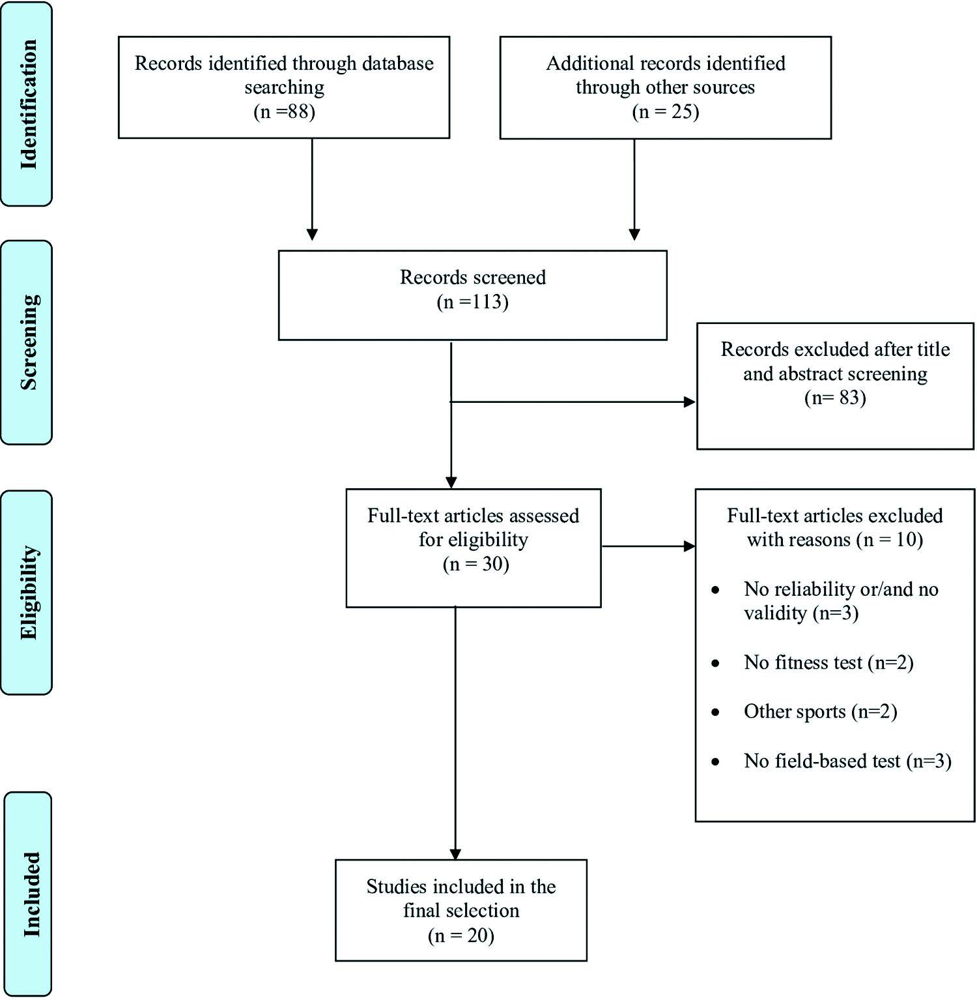

# 研究结果

A total of 113 studies were initially obtained. After removal of duplicate results, and those not related to the main aim of this review, 30 investigations were selected. After reading their full texts, 20 studies about the psychometric properties of field-based physical fitness tests in soccer referees were finally included for a complete analysis (Figure 1).

**Figure 1.** Flowchart of the search and selection process for inclusion of studies.